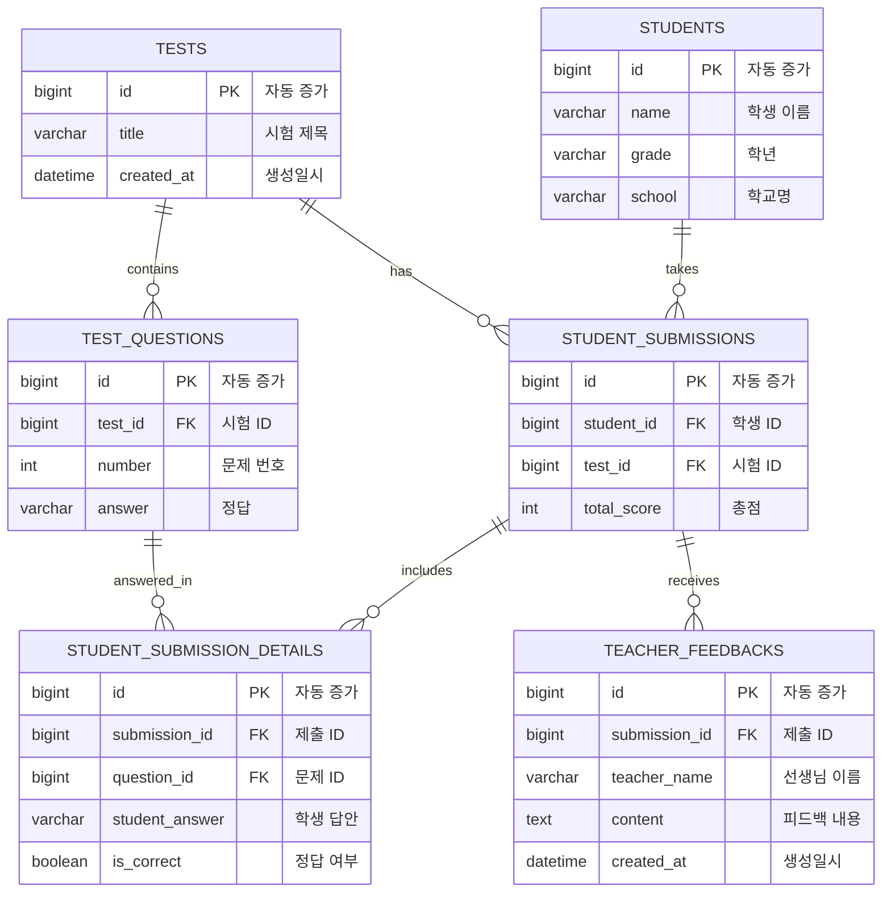

# 학원 관리 시스템 ERD (Entity Relationship Diagram)

## 데이터베이스 구조도

## 테이블 관계 설명

### 1. 학생 (STUDENTS)
- **역할**: 학원에 등록된 학생 정보 저장
- **관계**: 여러 시험 제출 기록을 가질 수 있음 (1:N with STUDENT_SUBMISSIONS)

### 2. 시험 (TESTS)
- **역할**: 시험 정보 저장
- **관계**: 
  - 여러 문제를 포함 (1:N with TEST_QUESTIONS)
  - 여러 학생 제출을 가짐 (1:N with STUDENT_SUBMISSIONS)

### 3. 시험 문제 (TEST_QUESTIONS)
- **역할**: 각 시험의 개별 문제와 정답 저장
- **관계**:
  - 특정 시험에 속함 (N:1 with TESTS)
  - 여러 학생 답안 상세를 가짐 (1:N with STUDENT_SUBMISSION_DETAILS)

### 4. 학생 제출 (STUDENT_SUBMISSIONS)
- **역할**: 학생의 시험 제출 정보와 총점 저장
- **관계**:
  - 특정 학생에 속함 (N:1 with STUDENTS)
  - 특정 시험에 대한 제출 (N:1 with TESTS)
  - 여러 답안 상세 포함 (1:N with STUDENT_SUBMISSION_DETAILS)
  - 여러 선생님 피드백을 받을 수 있음 (1:N with TEACHER_FEEDBACKS)

### 5. 학생 답안 상세 (STUDENT_SUBMISSION_DETAILS)
- **역할**: 각 문제에 대한 학생의 개별 답안과 채점 결과 저장
- **관계**:
  - 특정 제출에 속함 (N:1 with STUDENT_SUBMISSIONS)
  - 특정 문제에 대한 답안 (N:1 with TEST_QUESTIONS)

### 6. 선생님 피드백 (TEACHER_FEEDBACKS)
- **역할**: 학생 제출에 대한 선생님의 피드백 저장
- **관계**:
  - 특정 제출에 대한 피드백 (N:1 with STUDENT_SUBMISSIONS)

## 비즈니스 규칙

1. **유니크 제약조건**:
   - 한 학생은 같은 시험을 중복 제출할 수 없음 (STUDENT_SUBMISSIONS의 student_id + test_id)
   - 한 제출 내에서 같은 문제를 중복 답변할 수 없음 (STUDENT_SUBMISSION_DETAILS의 submission_id + question_id)

2. **CASCADE 삭제**:
   - 학생 삭제 시 관련 제출 기록도 삭제
   - 시험 삭제 시 관련 문제와 제출 기록도 삭제
   - 제출 삭제 시 관련 답안 상세와 피드백도 삭제

3. **자동 타임스탬프**:
   - 시험과 피드백은 생성 시 자동으로 현재 시간 기록

## 인덱스 전략

1. **Primary Keys**: 모든 테이블의 id 필드
2. **Foreign Keys**: 자동으로 인덱스 생성
3. **추가 인덱스**:
   - test_questions: (test_id, number) - 시험별 문제 번호 조회 최적화
   - student_submissions: student_id, test_id - 학생별/시험별 조회 최적화
   - teacher_feedbacks: created_at - 시간순 정렬 최적화